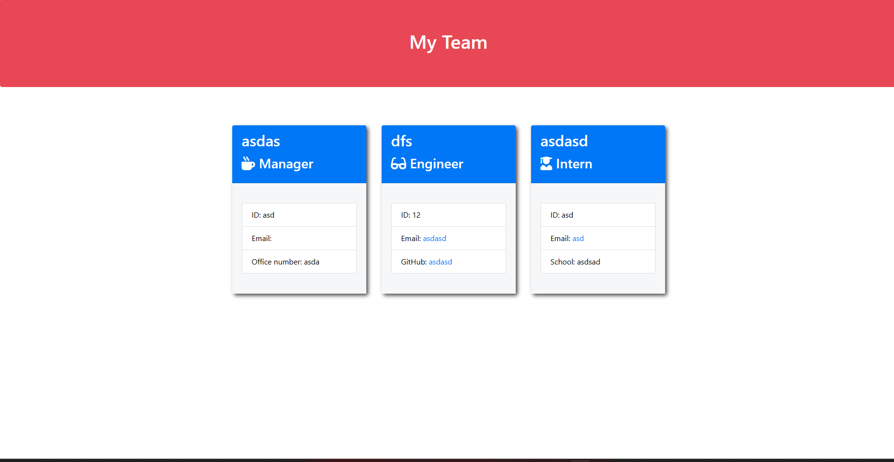

# team-pro-gen

## Table-of-Contents

  * [Description](#description)
  * [Installation](#installation)
  * [Usage](#usage)
  * [Questions](#questions)
  
  ## [Description](#table-of-contents)

  Youtube walthrough!
 https://youtu.be/e-WbFfT7lNw

  This project is a team generator that'll make it much easier to assign roles and positions.
  
  Here are mockup images:

  ## [Installation](#table-of-contents)

  No special installation required, click the repo and get started!

  ## [Usage](#table-of-contents)

  After installation is complete, run the following code: ‘node index.js’ in the terminal. Then answer the following questions and your team will be created shortly.
  

  ## [Questions](#table-of-contents)

  [GitHub](https://github.com/marsmeshed)

  Email: meek2004@live.com
